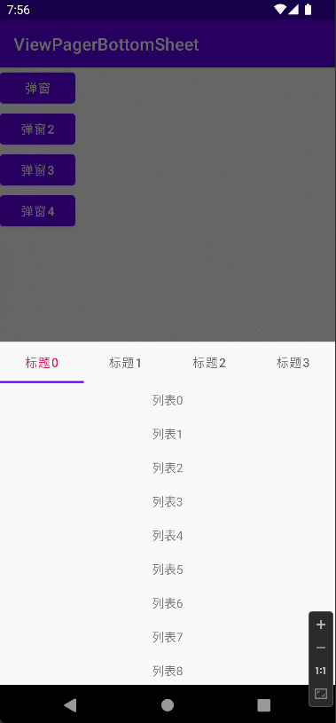
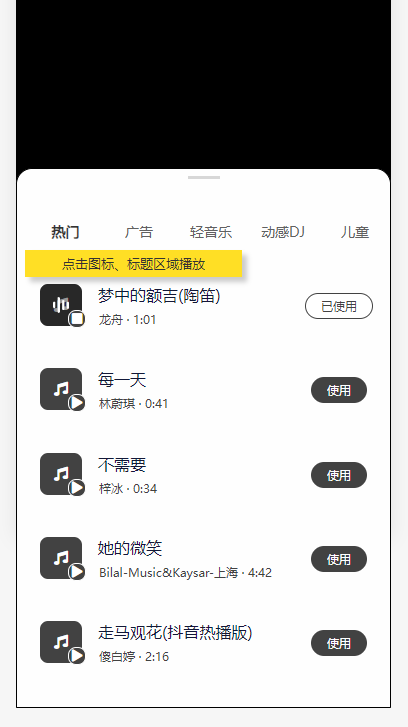
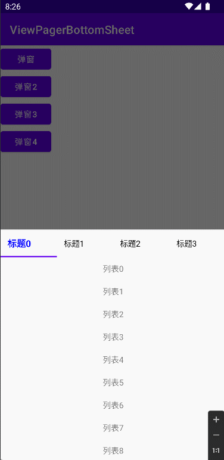

# ViewPagerBottomSheet
正确地处理`BottomSheet`中`ViewPager`的滑动事件。

最终效果



## 起因

需要开发一个如下样式的弹窗，上拉可以全屏。



## 开发过程

### 使用Xpop

Xpop是一个优秀的弹窗库，而且解决了嵌套滑动问题，可是不能上拉全屏。

在这里还是推荐下：[li-xiaojun/XPopup: 🔥XPopup2.0版本重磅来袭，2倍以上性能提升，带来可观的动画性能优化和交互细节的提升！！！功能强大，交互优雅，动画丝滑的通用弹窗！可以替代Dialog，PopupWindow，PopupMenu，BottomSheet，DrawerLayout，Spinner等组件，自带十几种效果良好的动画， 支持完全的UI和动画自定义！(Powerful and Beautiful Popup for Android，can absolutely replace Dialog，PopupWindow，PopupMenu，BottomSheet，DrawerLayout，Spinner. With built-in animators , very easy to custom popup view.) (github.com)](https://github.com/li-xiaojun/XPopup)

### 使用BottomSheetDialog

使用`BottomSheetDialog`可以满足需求，并且可以通过设置`peekHeight`来动态调整弹窗的初始高度，符合当前业务需求。

### 基础使用

[Android开发之BottomsheetDialogFragment的使用_神话2009的博客-CSDN博客_bottomsheetdialogfragment](https://blog.csdn.net/klxh2009/article/details/80393245)

[底部弹出抽屉BottomSheetDialogFragment，圆角背景，去除层叠，百分比设置高度【总结】_锟钢的博客-CSDN博客_bottomsheetdialogfragment圆角](https://blog.csdn.net/m0_38058826/article/details/81164373?spm=1001.2101.3001.6650.2&utm_medium=distribute.pc_relevant.none-task-blog-2~default~CTRLIST~Rate-2-81164373-blog-80393245.pc_relevant_paycolumn_v3&depth_1-utm_source=distribute.pc_relevant.none-task-blog-2~default~CTRLIST~Rate-2-81164373-blog-80393245.pc_relevant_paycolumn_v3&utm_relevant_index=5)


#### 遇到问题

当`BottomSheetDialog`内的布局是`ViewPager`的时候，会有滑动冲突问题。

具体表现为只有第一个tab下的RecycleView可以正确的滑动，其他tab页的滑动处理全部失效了。

#### 参考文章

[BottomSheetBehavior+ViewPager+多RecyclerView 滑动冲突（滑动弹出隐藏）终极解决方案 - 简书 (jianshu.com)](https://www.jianshu.com/p/b9a87d354c89)

[Android ViewPager with RecyclerView works incorrectly inside BottomSheet - Stack Overflow](https://stackoverflow.com/questions/37715822/android-viewpager-with-recyclerview-works-incorrectly-inside-bottomsheet)

[android - Scroll not working for multiple RecyclerView in BottomSheet - Stack Overflow](https://stackoverflow.com/questions/39326321/scroll-not-working-for-multiple-recyclerview-in-bottomsheet?noredirect=1&lq=1)

#### 问题定位

可以确定是`BottomSheetBehavior`没有正确处理子view的滑动事件导致的。

#### 问题解决

##### 参考文章

[BottomSheetDialogFragment + ViewPager+Fragment+RecyclerView 滑动问题_张海龙_China的博客-CSDN博客](https://blog.csdn.net/Jason_HD/article/details/121020496?spm=1001.2101.3001.6650.1&utm_medium=distribute.pc_relevant.none-task-blog-2~default~CTRLIST~default-1-121020496-blog-86526710.pc_relevant_aa&depth_1-utm_source=distribute.pc_relevant.none-task-blog-2~default~CTRLIST~default-1-121020496-blog-86526710.pc_relevant_aa&utm_relevant_index=2)

###### 方法1：修改`findScrollingChild`

因为BottomSheetBehavior的findScrollingChild方法并没有有关ViewPager 更新查找子元素view的东西，所以它只能拿到一个页面去滑动，那么就需要对BottomSheetBehavior进行修改，这样的话就需要自己定义BottomSheetDialog：

```java
@VisibleForTesting
    View findScrollingChild(View view) {
        if (ViewCompat.isNestedScrollingEnabled(view)) {
            return view;
        }
        if (view instanceof ViewPager) {
            ViewPager viewPager = (ViewPager) view;
            View currentViewPagerChild = viewPager.getChildAt(viewPager.getCurrentItem());
//            View currentViewPagerChild = ViewPagerUtils.getCurrentView(viewPager);
            if (currentViewPagerChild == null) {
                return null;
            }
 
            View scrollingChild = findScrollingChild(currentViewPagerChild);
            if (scrollingChild != null) {
                return scrollingChild;
            }
        } else if (view instanceof ViewGroup) {
            ViewGroup group = (ViewGroup) view;
            for (int i = 0, count = group.getChildCount(); i < count; i++) {
                View scrollingChild = findScrollingChild(group.getChildAt(i));
                if (scrollingChild != null) {
                    return scrollingChild;
                }
            }
        }
        return null;
    }
```

###### 方法2：使用`ViewPager2`规避

将`ViewPager`替换为`ViewPager2`确实可以解决部分滑动冲突问题，但是并没有彻底解决。

具体表现为RecyclerView区域滑动则不会将滑动事件抛给父View处理。滑动事件全部被 `RecyclerView` 消费掉，滑动弹出和关闭功能消失了。

导致这个问题的原因也很简单，我们的滑动事件在 `RecyclerView` 加入前，都是由 `BottomSheetBehavior` 来消费的，当我们加入 `RecyclerView` 这种可滑动控件后，滑动事件都被其消费，这与 `ViewPager` 无关。

> 多数情况下我们需要 `RecyclerView` 消费事件（滑动），但我们同时希望当 `RecyclerView` 滑动到顶部时，将事件又重新交给 `Behavior` 消费，这样就可以做到，列表在顶部时滑动开启/关闭弹出框。

现象如下：



只点击`TabLayout`才可以正确响应滑动事件，部分场景下可以满足需求。

###### 方法3：通过自定义`BottomSheetBehavior`，`BottomSheetDialog`来处理滑动事件

将以上方法结合，使用`ViewPager`，可以得到一个符合期望的弹窗。

### 最终结果

#### 参考仓库

[ZYF99/BottomSheetTest: BottomSheetBehavior+ViewPager冲突解决+回弹效果+速度调节 (github.com)](https://github.com/ZYF99/BottomSheetTest)

[laenger/ViewPagerBottomSheet: Use ViewPagers in Bottom Sheets! (github.com)](https://github.com/laenger/ViewPagerBottomSheet)

[JiangAndroidwork/BottomSheetViewPager (github.com)](https://github.com/JiangAndroidwork/BottomSheetViewPager)

[ParkSangGwon/TedBottomPicker: TedBottomPicker is simple image picker using bottom sheet (github.com)](https://github.com/ParkSangGwon/TedBottomPicker)

